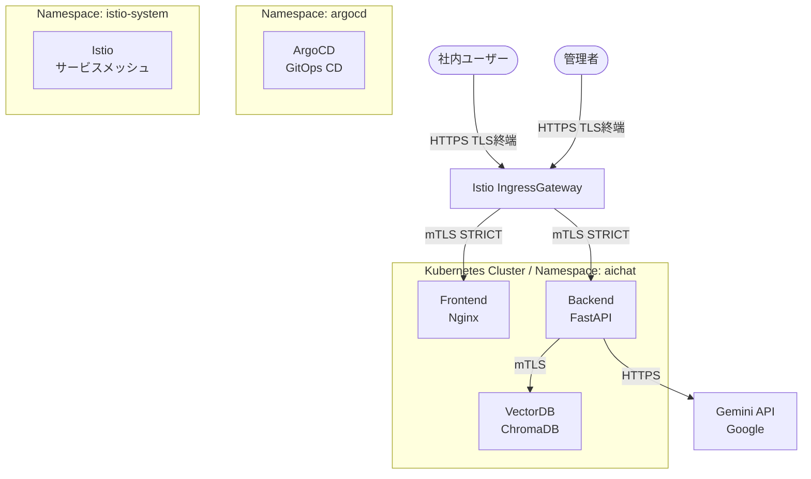
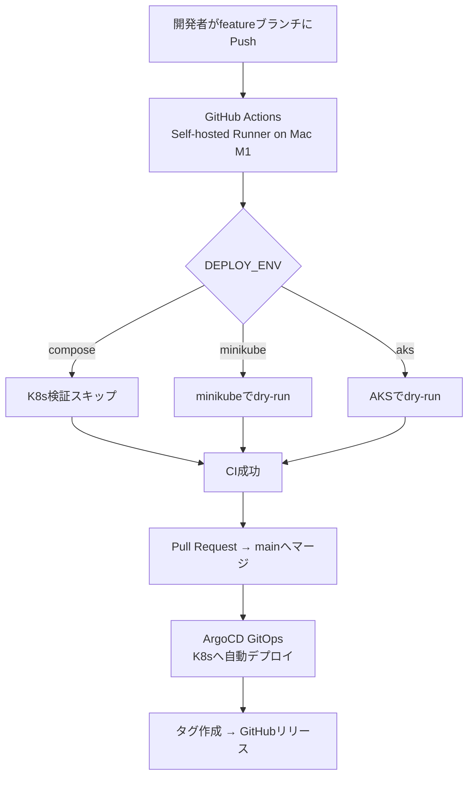

# Architecture Design

作成日: 2026-06-05　最終更新日: 2026-06-08

## アーキテクチャ設計

### 全体構成

---

### コンポーネント設計

#### Frontend（Nginx）

| 項目 | 内容 |
|------|------|
| イメージ | nginx:alpine |
| ポート | 80 |
| 役割 | 静的ファイル配信・リバースプロキシ |

#### Backend（FastAPI）

| 項目 | 内容 |
|------|------|
| イメージ | aichat:latest（カスタムビルド） |
| ポート | 8000 |
| 役割 | RAG処理・LLM連携・REST API提供・PDFインデックス化 |
| 環境変数 | CHROMA_HOST, CHROMA_PORT, GEMINI_API_KEY |
| エンドポイント | /api/chat, /api/specs, /api/indexer, /api/pdf/list, /api/pdf/index |

> ⚠️ `GEMINI_API_KEY` はソースコードに直接記載禁止。`.env` またはk8s Secretで管理すること。

#### VectorDB（ChromaDB）

| 項目 | 内容 |
|------|------|
| イメージ | chromadb/chroma:latest |
| ポート | 8000 |
| 役割 | ベクトルデータの保存・検索 |
| API | /api/v2 |
| 永続化 | PersistentVolume |

#### LLM（Gemini API）

| 項目 | 内容 |
|------|------|
| サービス | Google Gemini API |
| 埋め込みモデル | gemini-embedding-2 |
| 生成モデル | gemini-2.0-flash |
| 役割 | PDFベクトル化・RAG回答生成 |
| 認証 | GEMINI_API_KEY（環境変数） |

---

### 環境別構成

| 環境 | 基盤 | 用途 | 起動方法 |
|------|------|------|---------|
| 開発 | docker compose | ローカル開発・デバッグ | `./switch_to_compose.sh` |
| 検証（HTTP） | Minikube | K8s動作確認 | `./switch_to_minikube.sh && ./switch_to_http.sh` |
| 検証（HTTPS） | Minikube + Istio | mTLS動作確認 | `./switch_to_minikube.sh && ./switch_to_https.sh` |
| 本番 | AKS（Azure） | 社内サービス提供 | ArgoCD自動デプロイ |

---

### CI/CDパイプライン

---

### セキュリティアーキテクチャ

| レイヤー | 対策 | 実装 |
|---------|------|------|
| 外部通信 | HTTPS（TLS） | Istio Gateway + 自己署名証明書 |
| サービス間通信 | mTLS（STRICT） | Istio PeerAuthentication |
| APIキー管理 | 環境変数・Secrets管理 | .env / k8s Secret / Azure Key Vault |
| 認証 | Azure AD連携 | 予定 |
| ネットワーク | 社内限定 | NetworkPolicy |

---

### Istio設定

| リソース | ファイル | 内容 |
|---------|---------|------|
| Gateway | base/istio/gateway.yaml | 外部HTTPSトラフィック受付 |
| PeerAuthentication | base/istio/peer-auth.yaml | mTLS STRICT設定 |
| VirtualService | base/istio/virtual-service.yaml | トラフィックルーティング |
| DestinationRule | base/istio/destination-rule.yaml | mTLS ISTIO_MUTUAL設定 |
