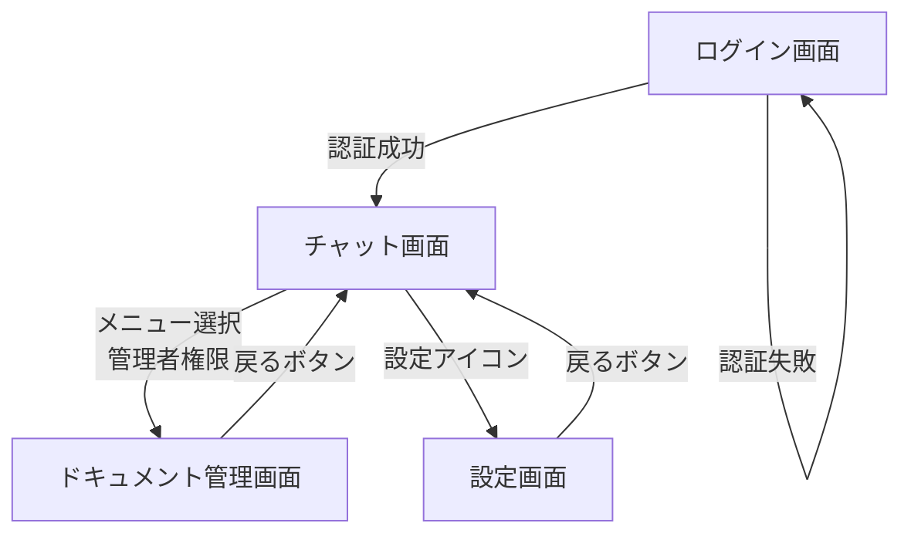

# Screen Transition

作成日: 2026-06-05

## 画面遷移図

---

## 画面遷移一覧

| 遷移元 | 遷移先 | トリガー | 条件 |
|--------|--------|---------|------|
| ログイン画面 | チャット画面 | ログインボタン | 認証成功 |
| ログイン画面 | ログイン画面 | ログインボタン | 認証失敗（エラー表示） |
| チャット画面 | ドキュメント管理画面 | メニュー選択 | 管理者権限 |
| チャット画面 | 設定画面 | 設定アイコン | なし |
| ドキュメント管理画面 | チャット画面 | 戻るボタン | なし |
| 設定画面 | チャット画面 | 戻るボタン | なし |

---

## 各画面の初期表示

| 画面 | 初期表示内容 |
|------|------------|
| ログイン画面 | ログインフォーム |
| チャット画面 | 「こんにちは！何でも聞いてください。」 |
| ドキュメント管理画面 | 登録済みドキュメント一覧 |
| 設定画面 | 現在のユーザー設定 |

---

## URLマッピング

| 画面 | URL |
|------|-----|
| チャット画面 | http://localhost:8000/ |
| APIドキュメント | http://localhost:8000/docs |
| ドキュメントビューア | http://localhost:8000/specs |
