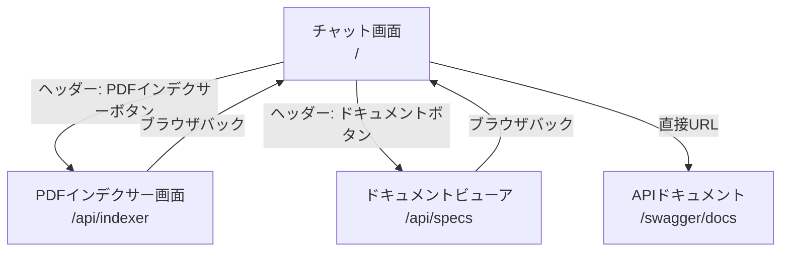

# Screen Transition

作成日: 2026-06-05　最終更新日: 2026-06-08

## 画面遷移図

---

## 画面遷移一覧

| 遷移元 | 遷移先 | トリガー | 条件 |
|--------|--------|---------|------|
| チャット画面 | PDFインデクサー画面 | ヘッダーのPDFインデクサーボタン | なし |
| チャット画面 | ドキュメントビューア | ヘッダーのドキュメントボタン | なし |
| PDFインデクサー画面 | チャット画面 | ブラウザバック | なし |
| ドキュメントビューア | チャット画面 | ブラウザバック | なし |

---

## 各画面の初期表示

| 画面 | 初期表示内容 |
|------|------------|
| チャット画面 | ウェルカムメッセージ「こんにちは！何でも聞いてください。」 |
| PDFインデクサー画面 | data/配下のPDFファイル一覧 |
| ドキュメントビューア | 目次（README.md） |

---

## URLマッピング

| 画面 | URL |
|------|-----|
| チャット画面 | http://localhost:8000/ |
| チャット画面（別名） | http://localhost:8000/api/chat/ui |
| PDFインデクサー画面 | http://localhost:8000/api/indexer |
| ドキュメントビューア | http://localhost:8000/api/specs |
| APIドキュメント | http://localhost:8000/swagger/docs |
