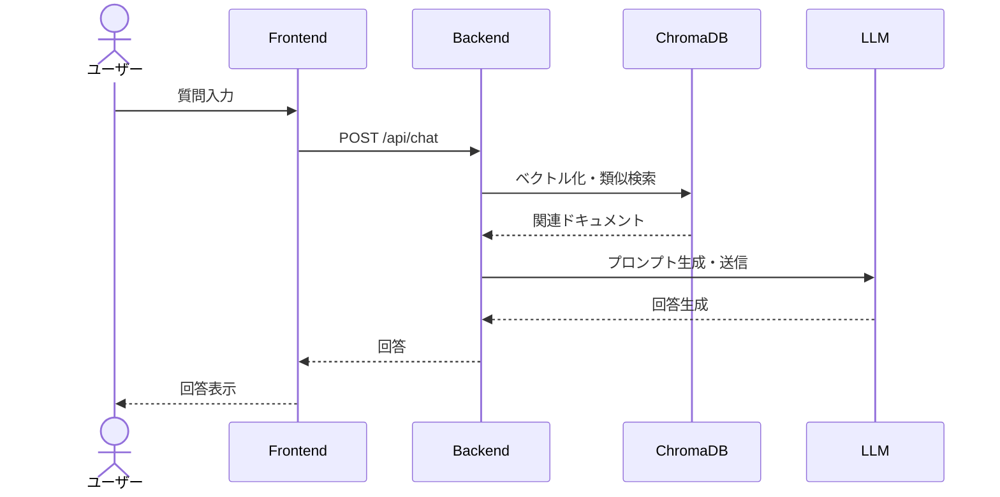
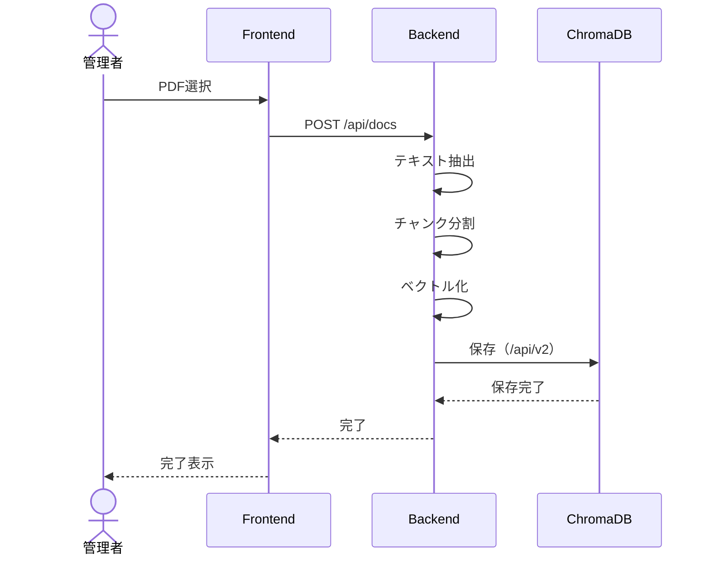
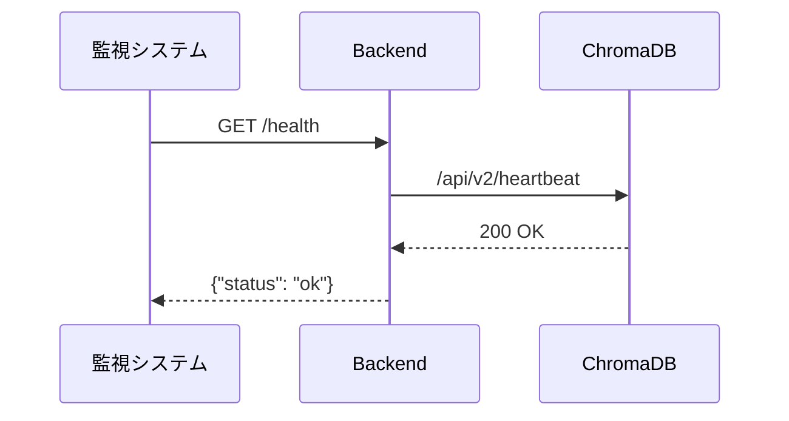
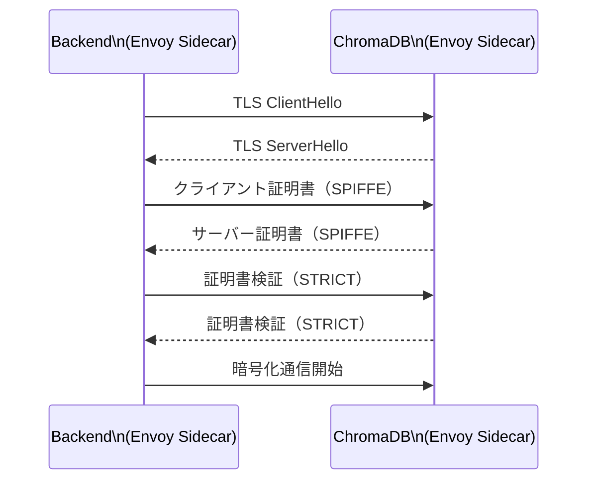
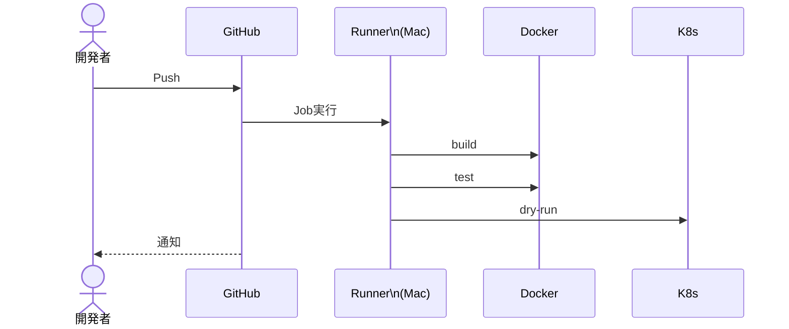

# Sequence Diagrams

作成日: 2026-06-05

## シーケンス図

### SD-001: チャット処理フロー

```mermaid
sequenceDiagram
    actor User as ユーザー
    participant FE as Frontend
    participant BE as Backend
    participant DB as ChromaDB
    participant LLM as LLM

    User->>FE: 質問入力
    FE->>BE: POST /api/chat
    BE->>DB: ベクトル化・類似検索
    DB-->>BE: 関連ドキュメント
    BE->>LLM: プロンプト生成・送信
    LLM-->>BE: 回答生成
    BE-->>FE: 回答
    FE-->>User: 回答表示
```

---

### SD-002: PDFアップロードフロー

```mermaid
sequenceDiagram
    actor Admin as 管理者
    participant FE as Frontend
    participant BE as Backend
    participant DB as ChromaDB

    Admin->>FE: PDF選択
    FE->>BE: POST /api/docs
    BE->>BE: テキスト抽出
    BE->>BE: チャンク分割
    BE->>BE: ベクトル化
    BE->>DB: 保存（/api/v2）
    DB-->>BE: 保存完了
    BE-->>FE: 完了
    FE-->>Admin: 完了表示
```

---

### SD-003: ヘルスチェックフロー

```mermaid
sequenceDiagram
    participant MON as 監視システム
    participant BE as Backend
    participant DB as ChromaDB

    MON->>BE: GET /health
    BE->>DB: /api/v2/heartbeat
    DB-->>BE: 200 OK
    BE-->>MON: {"status": "ok"}
```

---

### SD-004: mTLS通信フロー

```mermaid
sequenceDiagram
    participant BE as Backend\n(Envoy Sidecar)
    participant DB as ChromaDB\n(Envoy Sidecar)

    BE->>DB: TLS ClientHello
    DB-->>BE: TLS ServerHello
    BE->>DB: クライアント証明書（SPIFFE）
    DB-->>BE: サーバー証明書（SPIFFE）
    BE->>DB: 証明書検証（STRICT）
    DB-->>BE: 証明書検証（STRICT）
    BE->>DB: 暗号化通信開始
```

---

### SD-005: CI/CDフロー

```mermaid
sequenceDiagram
    actor Dev as 開発者
    participant GH as GitHub
    participant Runner as Runner\n(Mac)
    participant Docker as Docker
    participant K8s as K8s

    Dev->>GH: Push
    GH->>Runner: Job実行
    Runner->>Docker: build
    Runner->>Docker: test
    Runner->>K8s: dry-run
    GH-->>Dev: 通知
```
