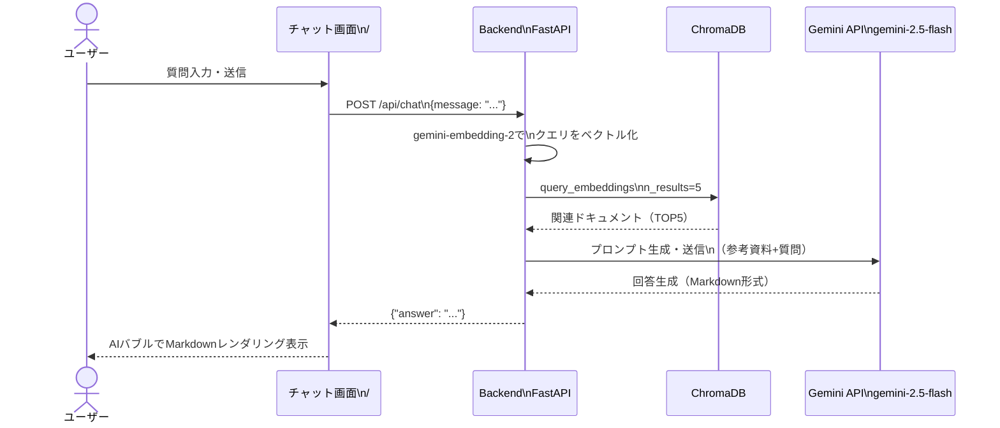
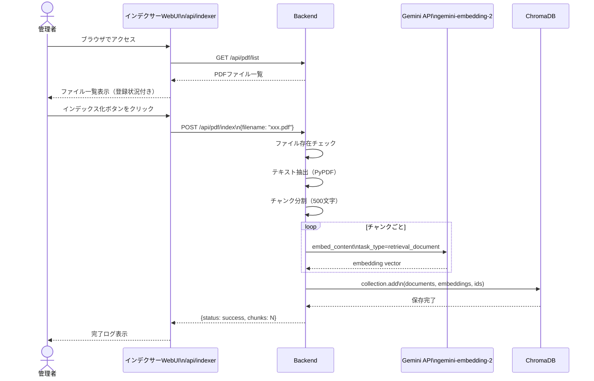
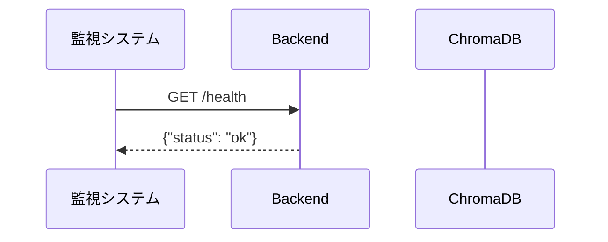
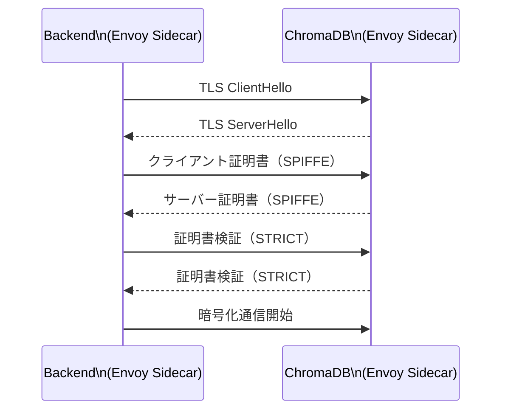
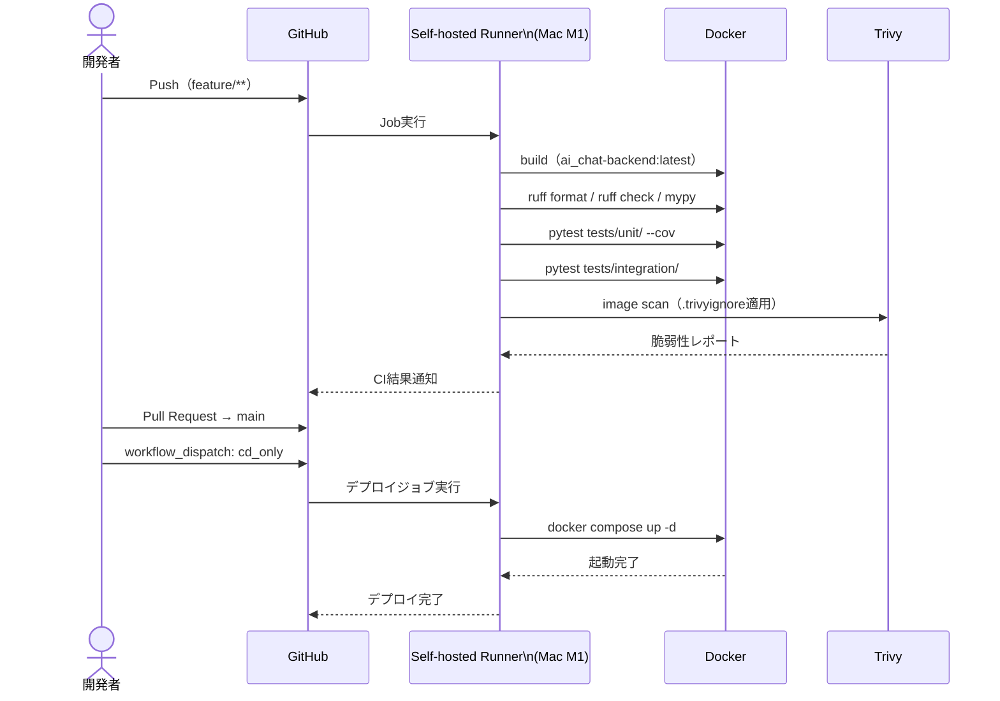
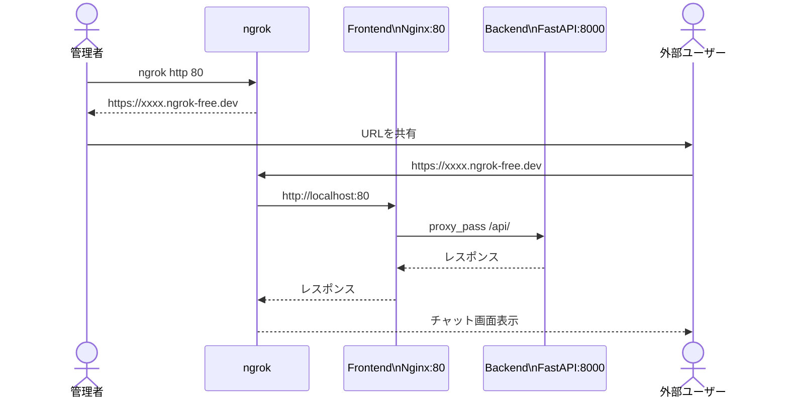

# Sequence Diagrams

作成日: 2026-06-05　最終更新日: 2026-06-14

## シーケンス図

### SD-001: チャット処理フロー

---

### SD-002: PDFインデックス化フロー

---

### SD-003: ヘルスチェックフロー

---

### SD-004: mTLS通信フロー

---

### SD-005: CI/CDフロー

---

### SD-006: ngrok外部公開フロー（ユーザーレビュー用）

