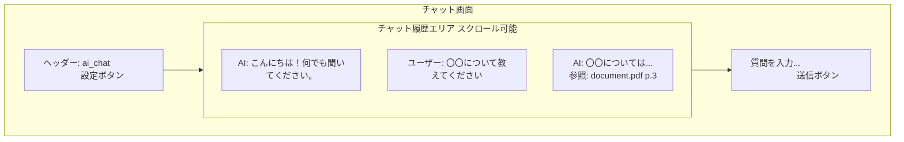
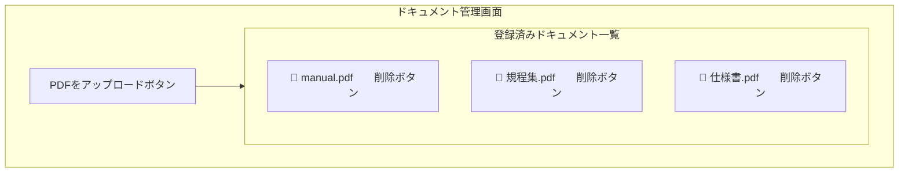
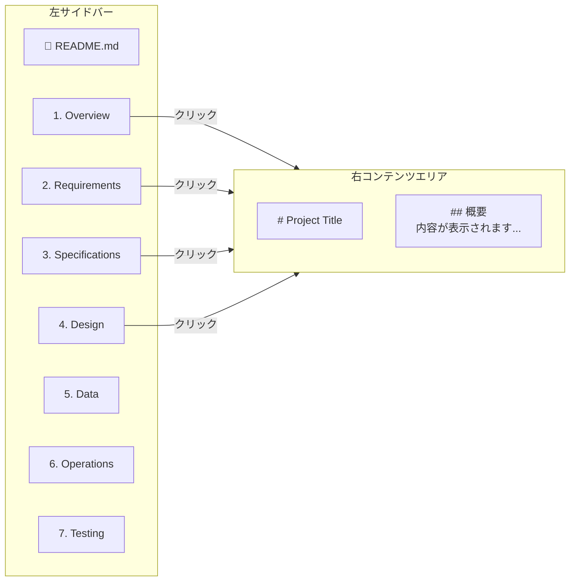

# UI Design

作成日: 2026-06-05

## UI設計

### 画面一覧

| 画面ID | 画面名 | URL | 概要 |
|--------|--------|-----|------|
| SCR-001 | チャット画面 | / | メインのチャットインターフェース |
| SCR-002 | ドキュメント管理画面 | /admin | PDFのアップロード・削除 |
| SCR-003 | 設定画面 | /settings | ユーザー設定 |
| SCR-004 | ドキュメントビューア | /specs | プロジェクトドキュメント表示 |
| SCR-005 | APIドキュメント | /docs | Swagger UI |

---

### SCR-001: チャット画面

**UI要素:**

| 要素 | 仕様 |
|------|------|
| チャット履歴 | スクロール可能・最新メッセージを下部に表示 |
| 入力フォーム | 複数行入力対応・Enterで送信 |
| 送信ボタン | 入力中はローディング表示 |
| 参照ドキュメント | クリックでドキュメント名・ページ数を表示 |

---

### SCR-002: ドキュメント管理画面

---

### SCR-004: ドキュメントビューア（/specs）

---

### デザインガイドライン

| 項目 | 仕様 |
|------|------|
| フォント | Noto Sans JP（日本語対応） |
| カラー | プライマリ: #1976D2、背景: #F5F5F5 |
| ドキュメントビューア | ダークテーマ（背景: #0f1117） |
| レスポンシブ | PC・タブレット対応 |
| 言語 | 日本語 |
