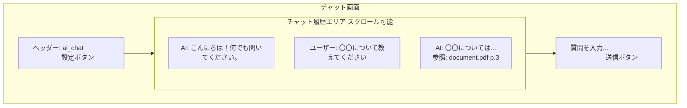
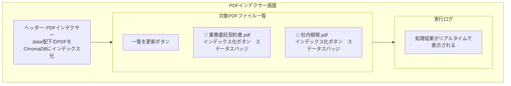
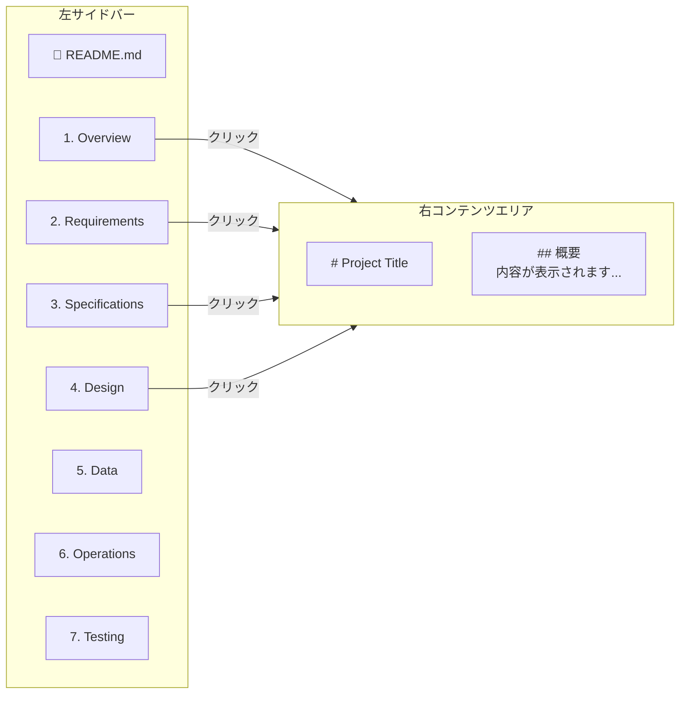

# UI Design

作成日: 2026-06-05　最終更新日: 2026-06-08

## UI設計

### 画面一覧

| 画面ID | 画面名 | URL | 概要 |
|--------|--------|-----|------|
| SCR-001 | チャット画面 | / | メインのチャットインターフェース |
| SCR-002 | PDFインデクサー画面 | /api/indexer | PDFのインデックス化・登録 |
| SCR-003 | 設定画面 | /settings | ユーザー設定 |
| SCR-004 | ドキュメントビューア | /api/specs | プロジェクトドキュメント表示 |
| SCR-005 | APIドキュメント | /swagger/docs | Swagger UI |

---

### SCR-001: チャット画面

**UI要素:**

| 要素 | 仕様 |
|------|------|
| チャット履歴 | スクロール可能・最新メッセージを下部に表示 |
| 入力フォーム | 複数行入力対応・Enterで送信 |
| 送信ボタン | 入力中はローディング表示 |
| 参照ドキュメント | クリックでドキュメント名・ページ数を表示 |

---

### SCR-002: PDFインデクサー画面（/api/indexer）

**UI要素:**

| 要素 | 仕様 |
|------|------|
| PDFファイル一覧 | GET /api/pdf/listで取得・一覧を更新ボタンで再取得 |
| インデックス化ボタン | クリックでPOST /api/pdf/indexを実行 |
| ステータスバッジ | 処理中・完了（チャンク数）・エラーを色付きで表示 |
| 実行ログ | 処理開始・完了・エラーをリアルタイムで表示 |

---

### SCR-004: ドキュメントビューア（/api/specs）

---

### デザインガイドライン

| 項目 | 仕様 |
|------|------|
| フォント | Noto Sans JP（日本語対応） |
| カラー | プライマリ: #8fa89b（Muted Green）、背景: #faf8f5 |
| レスポンシブ | PC・タブレット対応 |
| 言語 | 日本語 |
