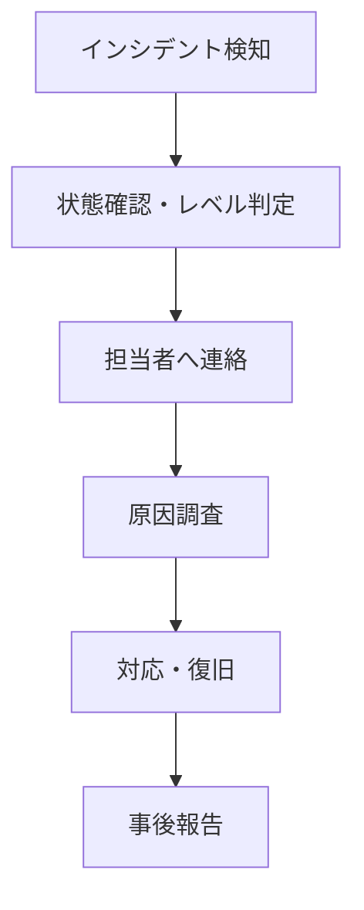

# Incident Response
<div align="right">作成日: 2026-06-05　最終更新日: 2026-06-14</div>

## インシデント対応手順

### インシデントレベル定義

| レベル | 内容 | 対応時間 |
|--------|------|---------|
| P1 | システム全停止 | 即時対応 |
| P2 | 主要機能停止 | 1時間以内 |
| P3 | 一部機能停止 | 当日対応 |
| P4 | 軽微な問題 | 翌営業日対応 |

---

### 対応フロー



---

### よくあるインシデントと対応

#### P1: チャットが完全に使えない

```bash
# 1. コンテナ状態確認
docker compose ps

# 2. ログ確認
docker compose logs -f backend

# 3. 再起動
docker compose restart backend

# K8s環境の場合
kubectl get pods -n aichat
kubectl logs -f deploy/backend -n aichat -c fastapi-app
kubectl rollout restart deployment/backend -n aichat
```

#### P2: ChromaDB接続エラー（E001）

```bash
# 1. ChromaDB状態確認
docker compose ps

# 2. ヘルスチェック
curl http://localhost:8001/api/v2/heartbeat

# 3. ChromaDB再起動
docker compose restart vectordb

# K8s環境の場合
kubectl rollout restart deployment/vectordb -n aichat
```

#### P2: docker composeでDocker接続エラー

```bash
# Docker PATHが通っていない場合
export PATH="/Applications/Docker.app/Contents/Resources/bin:$PATH"

# Minikubeモードのままになっている場合
eval $(minikube docker-env -u)
docker compose up -d
```

#### P3: レスポンスが遅い

```bash
# リソース使用状況確認（K8s環境）
kubectl top pods -n aichat

# Pod数を増やす
kubectl scale deployment/backend --replicas=2 -n aichat
```

#### P3: CIが実行されない（待機中のまま）

```bash
# Runnerが起動しているか確認
ps aux | grep Runner.Listener | grep -v grep

# Runnerを再起動
kill -9 $(pgrep -f Runner.Listener)
cd ~/git_lesson/ai_chat/actions-runner
./run.sh &
```

#### P3: Trivyスキャンでエラー

```bash
# Docker socket確認
ls -la /var/run/docker.sock

# .trivyignoreに新たなCVEを追加する場合
echo "CVE-XXXX-XXXXX" >> .trivyignore
git add .trivyignore
git commit -m "fix: add CVE-XXXX-XXXXX to .trivyignore"
git push origin feature/xxx
```

#### P4: ngrok経由でアクセスできない

```bash
# ngrokの状態確認
curl http://localhost:4040/api/tunnels | grep addr

# ngrokを再起動（ポート80向け）
kill $(pgrep -f ngrok)
ngrok http 80
```

---

### 事後報告テンプレート

```
## インシデント報告

- 発生日時:
- 復旧日時:
- レベル:
- 影響範囲:
- 原因:
- 対応内容:
- 再発防止策:
```
