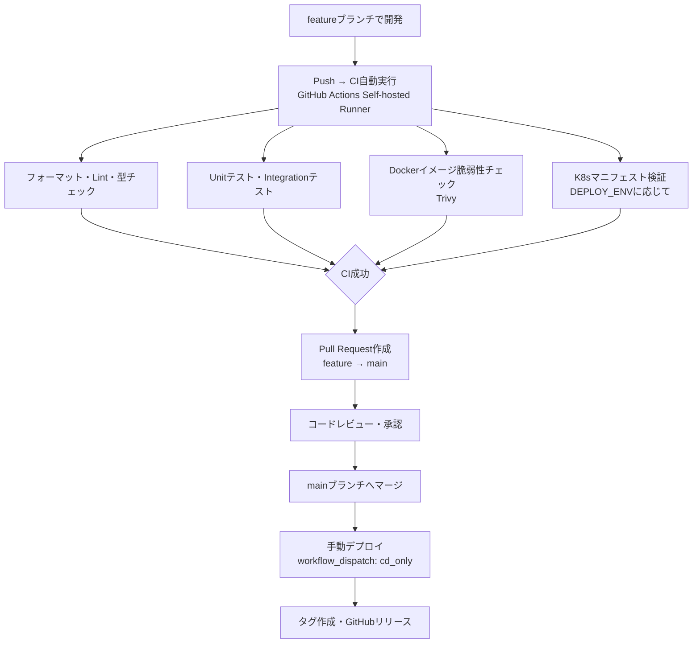

# Release Procedure
<div align="right">作成日: 2026-06-05　最終更新日: 2026-06-14</div>

## リリース手順

### リリースフロー



---

### ブランチ命名規則

| 種別 | 命名規則 | 例 |
|------|---------|-----|
| 機能追加 | feature/redmine-{番号}-{内容} | feature/redmine-123-ai_chat |
| バグ修正 | fix/redmine-{番号}-{内容} | fix/redmine-124-chat_error |
| 緊急修正 | hotfix/{内容} | hotfix/critical_bug |

---

### リリース前チェックリスト

- [ ] CIが全て成功しているか（Unit/Integration/Trivy/K8s検証）
- [ ] コードレビューが完了しているか
- [ ] テストが全て成功しているか（30件Unit・12件Integration）
- [ ] カバレッジが確認されているか（現状55%）
- [ ] ドキュメントが更新されているか（docs/testing/配下を含む）
- [ ] `.gitignore`に不要なファイルが含まれていないか
- [ ] `.trivyignore`に新たなCVEを追加・確認したか
- [ ] `actions-runner/`がGit管理対象外であるか
- [ ] `src/backend/data/`がGit管理対象外であるか（.gitignore確認）

---

### タグ・リリース作成手順

```bash
# mainブランチに切り替え
git checkout main
git pull origin main

# 既存タグの確認
git tag

# タグ作成
git tag v0.2.0
git push origin v0.2.0
```

**タグ変更が必要な場合:**

```bash
# 既存タグと同じコミットに新しいタグを作成
git tag v0.1.10 $(git rev-list -n 1 v0.10.0)
git push origin v0.1.10

# 古いタグを削除
git push origin :refs/tags/v0.10.0
git tag -d v0.10.0
```

---

### デプロイ手順（cd_only）

```bash
# GitHub → Actions → CI → Run workflow
# Branch: main（またはfeatureブランチ）
# 実行モード: cd_only
# Run workflow をクリック
```

デプロイ完了後に確認：

```bash
docker compose ps
curl http://localhost:8000/health
```

---

### ロールバック手順

```bash
# ArgoCDで前バージョンに戻す
argocd app rollback aichat

# または手動でイメージタグを変更
kubectl set image deployment/backend \
  fastapi-app=ai_chat-backend:前バージョンのタグ -n aichat

# タグから修正ブランチを作成
git checkout -b hotfix/v0.1.1 v0.1.0
```

---

### リリース記録

| バージョン | 日付 | 内容 |
|-----------|------|------|
| v0.1.0 | 2026-06-14 | 初期リリース（RAG基盤・CI/CD・mTLS・ドキュメントビューア・PDFインデクサー・Markdownレンダリング・Trivy脆弱性チェック） |
