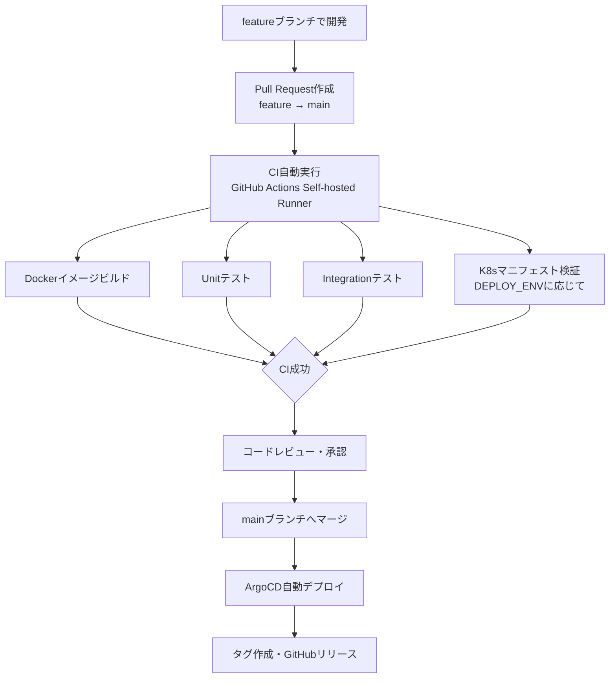

# Release Procedure
<div align="right">作成日: 2026-06-05</div>

## リリース手順

### リリースフロー



---

### ブランチ命名規則

| 種別 | 命名規則 | 例 |
|------|---------|-----|
| 機能追加 | feature/redmine-{番号}-{内容} | feature/redmine-123-ai_chat |
| バグ修正 | fix/redmine-{番号}-{内容} | fix/redmine-124-chat_error |
| 緊急修正 | hotfix/{内容} | hotfix/critical_bug |

---

### リリース前チェックリスト

- [ ] CIが全て成功しているか
- [ ] コードレビューが完了しているか
- [ ] テストが全て成功しているか
- [ ] ドキュメントが更新されているか
- [ ] `.gitignore`に不要なファイルが含まれていないか
- [ ] `actions-runner/`がGit管理対象外であるか

---

### タグ・リリース作成手順

```bash
# mainブランチに切り替え
git switch main
git pull origin main

# タグ作成
git tag v0.2.0
git push origin v0.2.0
```

GitHubでリリース作成：
```
https://github.com/redmine54/ai_chat/releases/new
→ タグを選択 → タイトル・説明を入力 → Publish release
```

---

### ロールバック手順

```bash
# ArgoCDで前バージョンに戻す
argocd app rollback aichat

# または手動でイメージタグを変更
kubectl set image deployment/backend \
  fastapi-app=aichat:前バージョンのタグ -n aichat

# タグから修正ブランチを作成
git checkout -b hotfix/v0.1.1 v0.1.0
```

---

### リリース記録

| バージョン | 日付 | 内容 |
|-----------|------|------|
| v0.1.0 | 2026-06-05 | 初期リリース（RAG基盤・CI/CD・mTLS・ドキュメントビューア） |
