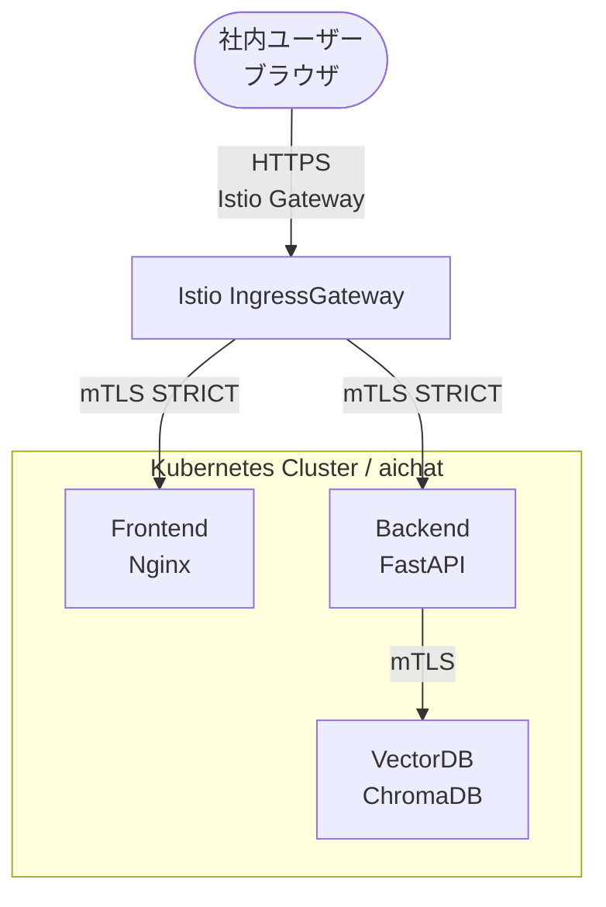
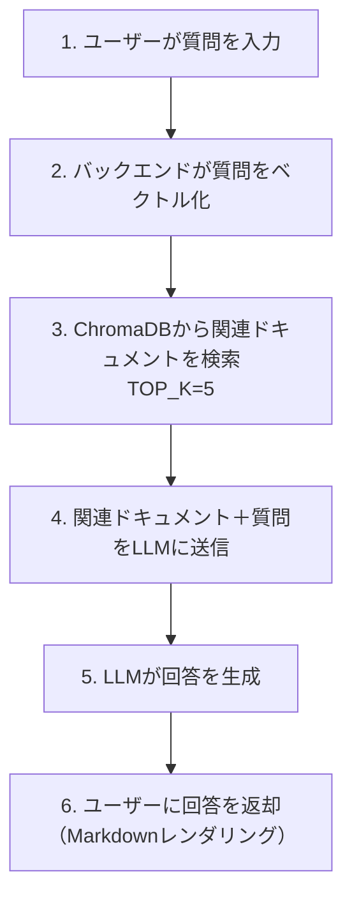
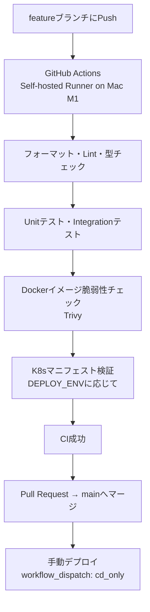

# System Overview

作成日: 2026-06-05　最終更新: 2026-06-14

## システム概要

社内PDFドキュメントを知識ベースとしたRAG（Retrieval-Augmented Generation）+LLMチャットシステムです。社内ネットワーク内でのみ動作するセキュアな構成を採用しています。

## システム構成図

## コンポーネント

| コンポーネント | 技術 | 役割 |
|--------------|------|------|
| フロントエンド | Nginx | チャットUI提供・リバースプロキシ |
| バックエンド | FastAPI（Python 3.12） | RAG処理・LLM連携 |
| ベクトルDB | ChromaDB（API v2） | PDFのベクトルデータ管理 |
| サービスメッシュ | Istio | mTLS・トラフィック管理 |
| コンテナ基盤 | Kubernetes（Minikube/AKS） | コンテナオーケストレーション |
| GitOps/CD | ArgoCD | 自動デプロイ管理 |
| CI | GitHub Actions（Self-hosted Runner on Mac M1） | テスト・ビルド・デプロイ自動化 |
| IaC | Terraform | AKSインフラ管理 |
| 外部公開 | ngrok | compose環境でのユーザーレビュー用一時公開 |

## RAG処理フロー

## 環境構成

| 環境 | 用途 | 基盤 | 起動方法 |
|------|------|------|---------|
| 開発 | ローカル開発・デバッグ・ユーザーレビュー | docker compose | `./switch_to_compose.sh` |
| 検証 | K8s・mTLS動作確認 | Minikube | `./switch_to_minikube.sh` |
| 本番 | 社内サービス提供 | AKS（Azure） | ArgoCD自動デプロイ |

## CI/CDパイプライン

**CIの実行モード（workflow_dispatch）:**

| モード | 内容 |
|--------|------|
| ci_only | テストのみ実行（デフォルト） |
| ci_then_cd | テスト完了後に自動デプロイ |
| cd_only | デプロイのみ実行（テストをスキップ） |

## セキュリティ

| 対策 | 内容 |
|------|------|
| mTLS | サービス間通信の暗号化（Istio PeerAuthentication STRICT） |
| HTTPS | 外部通信の暗号化（Istio Gateway + TLS証明書） |
| 社内限定 | 社内ネットワーク内でのみ動作 |
| APIキー管理 | GEMINI_API_KEYは環境変数・GitHub Secretsで管理 |
| 認証 | Azure AD連携（予定） |
| 脆弱性チェック | Trivyによるコンテナイメージの脆弱性スキャン（CI自動実行） |
