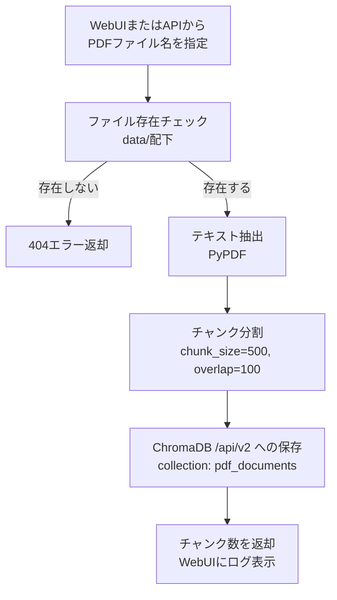
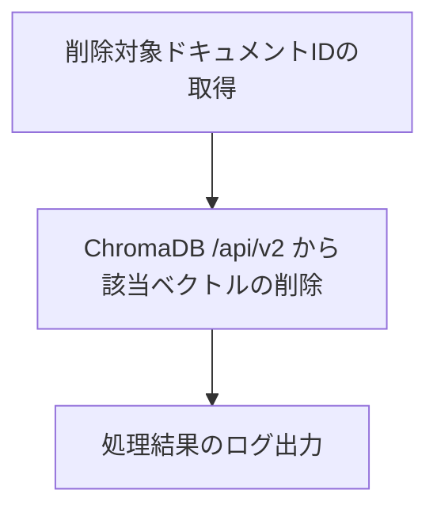

# Batch Specification
<div align="right">作成日: 2026-06-05　最終更新日: 2026-06-08</div>

## バッチ仕様

### BATCH-001: PDFインデックス作成バッチ

| 項目 | 内容 |
|------|------|
| バッチ名 | pdf_indexer |
| 概要 | `src/backend/data/` 配下のPDFをベクトル化してChromaDBに登録する |
| 実行タイミング | WebUI（/api/indexer）からの手動実行 または Kubernetes Job |
| 実行環境 | docker compose / Minikube / AKS |
| 実装 | `rag.py` の `extract_and_store_pdf()` を使用 |

**処理フロー:**



**パラメータ:**

| パラメータ | デフォルト値 | 説明 |
|-----------|------------|------|
| chunk_size | 500 | チャンクの文字数 |
| chunk_overlap | 100 | チャンク間のオーバーラップ文字数 |
| collection_name | pdf_documents | ChromaDBのコレクション名 |
| top_k | 5 | 検索結果の最大取得件数 |

**エラー処理:**

| エラー | 対応 |
|--------|------|
| PDFが存在しない | 404エラーを返却 |
| PDF以外のファイル指定 | 400エラーを返却 |
| PDFが破損している | 500エラーを返却しログに記録 |
| ChromaDB接続エラー（E001） | リトライ（3回）後にエラー終了 |
| ベクトル化エラー（E004） | 500エラーを返却しログに記録 |

**WebUIからの実行方法:**

```
http://localhost:8000/api/indexer
```

1. PDFファイル一覧から対象ファイルを選択
2. 「インデックス化」ボタンをクリック
3. 実行ログでチャンク数・完了状態を確認

---

### BATCH-002: ドキュメント削除バッチ

| 項目 | 内容 |
|------|------|
| バッチ名 | pdf_cleaner |
| 概要 | 削除対象のドキュメントをChromaDBから削除する |
| 実行タイミング | 手動実行 |
| 実行環境 | Kubernetes Job |

**処理フロー:**


