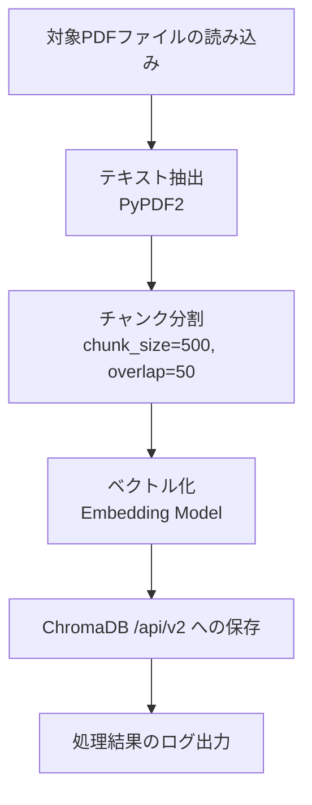
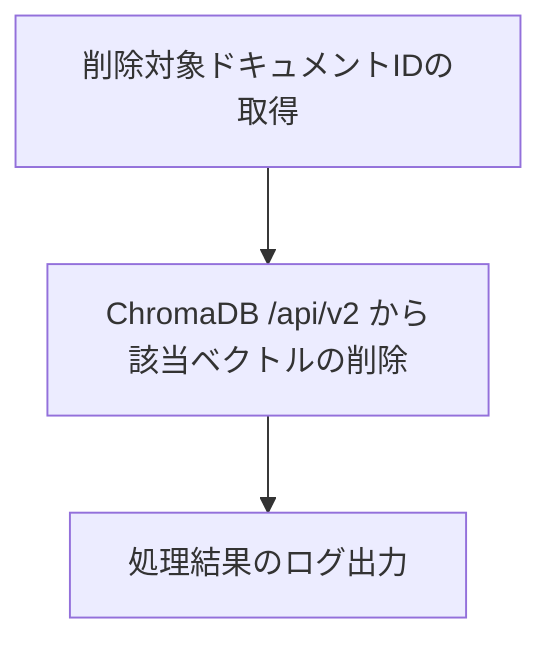

# Batch Specification

作成日: 2026-06-05

## バッチ仕様

### BATCH-001: PDFインデックス作成バッチ

| 項目 | 内容 |
|------|------|
| バッチ名 | pdf_indexer |
| 概要 | 新規PDFドキュメントをベクトル化してChromaDBに登録する |
| 実行タイミング | PDFアップロード時（手動実行） |
| 実行環境 | Kubernetes Job |

**処理フロー:**

**パラメータ:**

| パラメータ | デフォルト値 | 説明 |
|-----------|------------|------|
| chunk_size | 500 | チャンクの文字数 |
| chunk_overlap | 50 | チャンク間のオーバーラップ文字数 |
| collection_name | documents | ChromaDBのコレクション名 |
| top_k | 5 | 検索結果の最大取得件数 |

**エラー処理:**

| エラー | 対応 |
|--------|------|
| PDFが破損している | スキップしてログに記録 |
| ChromaDB接続エラー（E001） | リトライ（3回）後にエラー終了 |
| ベクトル化エラー（E004） | スキップしてログに記録 |

---

### BATCH-002: ドキュメント削除バッチ

| 項目 | 内容 |
|------|------|
| バッチ名 | pdf_cleaner |
| 概要 | 削除対象のドキュメントをChromaDBから削除する |
| 実行タイミング | 手動実行 |
| 実行環境 | Kubernetes Job |

**処理フロー:**

