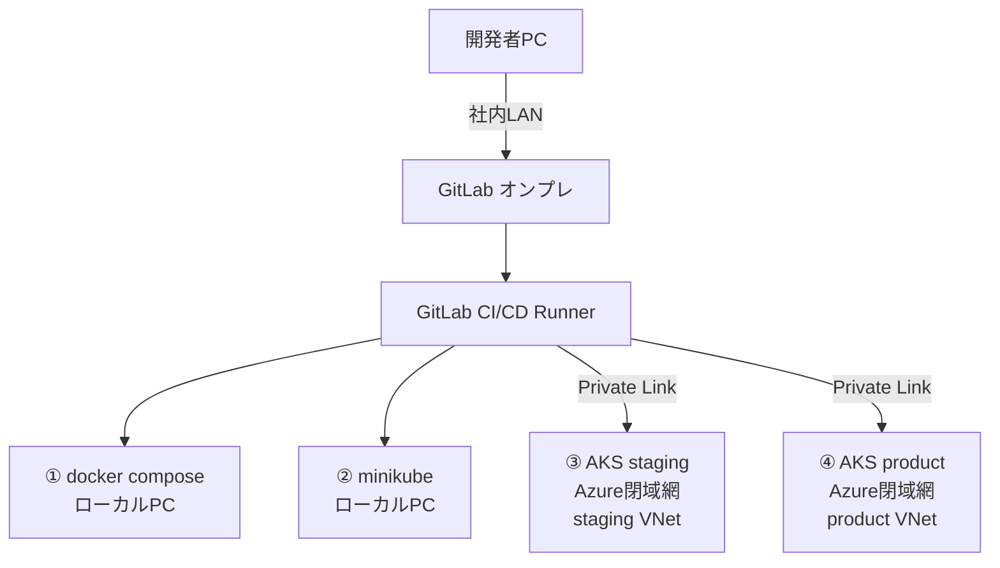

# 3. セキュリティ設計

最終更新日: 2026-06-07

## Secrets管理（環境別）

| 環境     | 管理方法                                                       |
| -------- | -------------------------------------------------------------- |
| compose  | `.env`ファイル（`.gitignore`必須）、開発者個人管理             |
| minikube | `kubectl create secret`でローカル投入、GitLab CI変数（Masked） |
| staging  | Azure Key Vault + External Secrets Operator                    |
| product  | Azure Key Vault + External Secrets Operator（本番専用Vault）   |

## ネットワーク分離

- staging / product は **Azure閉域網（Private Endpoint）** で外部インターネットから遮断
- staging と product は **別VNet** で分離し、ピアリングも禁止
- GitLab Runnerは社内LANからAzureへPrivate Link経由でのみ接続

## RBAC設計

| ロール           | compose      | minikube     | staging    | product      |
| ---------------- | ------------ | ------------ | ---------- | ------------ |
| 開発者           | フルアクセス | フルアクセス | 参照のみ   | 禁止         |
| リードエンジニア | フルアクセス | フルアクセス | デプロイ可 | 参照のみ     |
| リリース担当     | ー           | ー           | 承認       | デプロイ可   |
| 運用担当         | ー           | ー           | 参照       | フルアクセス |

## データ分離原則

- 本番DBへの開発者アクセス完全禁止（AKS Network Policy + Azure Private Endpoint）
- staging用テストデータは**匿名化・マスキング済みデータ**のみ使用
- DBの接続文字列は環境ごとに完全に異なるものを使用し、流用禁止
